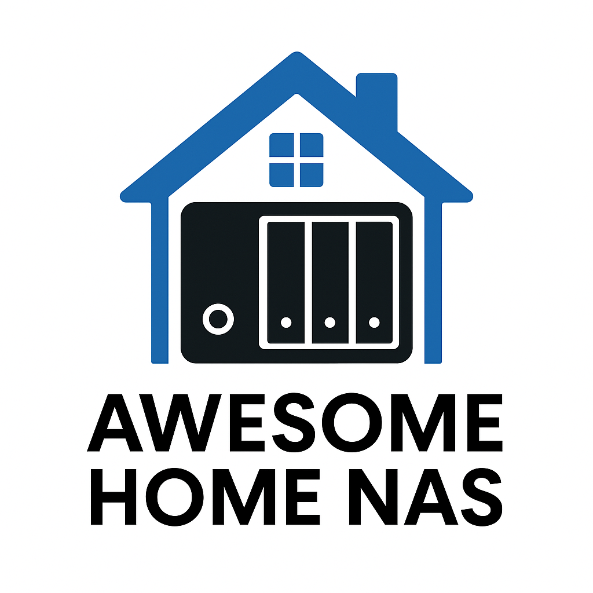

# 🏠 Awesome Home NAS

> 一个精心整理的家庭NAS服务和工具集合，帮助您构建功能强大的家庭媒体中心和个人云服务系统。特别适合中国用户的NAS环境。

  

## 📋 目录

- [🎬 媒体管理](#-媒体管理)
  - [🖥️ 媒体服务器](#️-媒体服务器)
  - [⬇️ 媒体下载工具](#️-媒体下载工具)
  - [🔍 自动化媒体索引与处理工具](#-自动化媒体索引与处理工具)
  - [🤖 自动化媒体下载管理工具](#-自动化媒体下载管理工具)
  - [📝 元数据管理](#-元数据管理)
  - [💬 字幕工具](#-字幕工具)
  - [📸 照片管理](#-照片管理)
- [☁️ 网盘与存储](#️-网盘与存储)
  - [💾 云存储挂载工具](#-云存储挂载工具)
  - [🔄 网盘自动化工具](#-网盘自动化工具)
  - [🗄️ 自建网盘解决方案](#️-自建网盘解决方案)
  - [🔁 文件同步工具](#-文件同步工具)
- [🧠 AI相关](#-ai相关)
- [🏡 智能家居](#-智能家居)
- [🌐 翻译工具](#-翻译工具)
- [📚 学习工具](#-学习工具)
- [📊 服务器监控](#-服务器监控)
- [💻 开发和工具](#-开发和工具)
- [🌍 网络服务](#-网络服务)
- [🛠️ 实用工具](#️-实用工具)
- [📱 社交媒体和内容](#-社交媒体和内容)
- [🤝 贡献](#-贡献)
- [📜 许可证](#-许可证)

## 🎬 媒体管理

### 🖥️ 媒体服务器

| 名称 | 优缺点 | 价格 | 开源 |
|------|------|------|------|
| [**Emby Server**](https://emby.media/) | 优点：功能强大，界面美观，支持多种设备，元数据管理出色 缺点：部分高级功能需要付费，中文搜索支持一般，插件非常丰富 |   $54/年或 $119/一次性买断 |  |
| [**Jellyfin**](https://jellyfin.org/) | 优点：完全免费，功能丰富，无限制用户，社区活跃 缺点：部分插件不稳定，界面相对简单 |  |  |
| [**Plex**](https://www.plex.tv/) | 优点：界面精美，跨平台支持完善，生态丰富，稳定性好 缺点：高级功能需付费，定制性较低 |   $119/一次性买断 |  |
| [**Navidrome**](https://www.navidrome.org/) | 优点：轻量级，专注音乐，资源占用低 缺点：仅支持音乐，功能相对单一 |  |  |
| [**Stash**](https://github.com/stashapp/stash) | 优点：针对成人内容优化，元数据和标签系统强大 缺点：仅适用于特定内容，学习曲线较陡 |  |  |

### ⬇️ 媒体下载工具

| 名称 | 优缺点 | 价格 | 开源 |
|------|------|------|------|
| [**qBittorrent**](https://www.qbittorrent.org/) | 优点：界面友好，功能丰富，支持RSS自动下载 缺点：高并发下可能不稳定 |  |  |
| [**Transmission**](https://transmissionbt.com/) | 优点：轻量级，资源占用低，稳定性高 缺点：界面简洁但功能相对基础 |  |  |
| [**Aria2**](https://aria2.github.io/) | 优点：多协议支持，资源占用极低 缺点：无GUI界面，配置相对复杂 |  |  |

### 🔍 自动化媒体索引与处理工具

| 名称 | 优缺点 | 价格 | 开源 |
|------|------|------|------|
| [**Jackett**](https://github.com/Jackett/Jackett) | 优点：支持多种站点，API集成方便 缺点：需要定期更新以适应站点变化 |  |  |
| [**Prowlarr**](https://github.com/Prowlarr/Prowlarr) | 优点：索引管理更现代化，自动更新tracker 缺点：部分小众站点支持不完善 |  |  |
| [**Unpackerr**](https://github.com/davidnewhall/unpackerr) | 优点：自动解压节省手动操作 缺点：偶尔需要手动干预复杂压缩包 |  |  |

### 🤖 自动化媒体下载管理工具

| 名称 | 优缺点 | 价格 | 开源 |
|------|------|------|------|
| [**MoviePilot**](https://github.com/jxxghp/MoviePilot) | 优点：适合中国用户，集成度高，支持站点多 缺点：配置略复杂，需要一定学习成本 |  |  |
| [**Radarr**](https://radarr.video/) | 优点：电影管理自动化程度高，社区活跃 缺点：对中文内容支持一般 |  |  |
| [**Sonarr**](https://sonarr.tv/) | 优点：剧集追踪完善，季度管理出色 缺点：对动漫支持不够完善 |  |  |
| [**Lidarr**](https://lidarr.audio/) | 优点：音乐收集自动化，元数据丰富 缺点：对小众音乐支持有限 |  |  |

### 📝 元数据管理

| 名称 | 优缺点 | 价格 | 开源 |
|------|------|------|------|
| [**Metatube**](https://github.com/XuQian-iOS/MetaTube) | 优点：专注于XX内容元数据，刮削效果好 缺点：仅适用于特定内容类型，无法获取常规媒体数据 |  |  |
| [**tinyMediaManager**](https://www.tinymediamanager.org/) | 优点：支持多种媒体库，元数据来源丰富 缺点：重度使用时较占资源 |  /   €12/年 |  |
| [**Emby-Media_images**](https://github.com/weizongxyz/Emby-Media_images) | 优点：针对中文用户优化，图像资源丰富 缺点：仅支持Emby系统 |  |  |

### 💬 字幕工具

| 名称 | 优缺点 | 价格 | 开源 |
|------|------|------|------|
| [**Chinesesubfinder**](https://github.com/allanpk716/ChineseSubFinder) | 优点：专注中文字幕，自动匹配能力强 缺点：部分冷门内容字幕资源有限 |  |  |
| [**字幕组机器人**](https://github.com/EstrellaXD/Auto_Bangumi) | 优点：动漫字幕资源丰富，自动化程度高 缺点：仅针对动漫内容 |  |  |

### 📸 照片管理

| 名称 | 优缺点 | 价格 | 开源 |
|------|------|------|------|
| [**MtPhotos**](https://mtmt.tech/) | 优点：界面简洁，中文支持好 缺点：高级功能较少 |  一个月/   ¥3/月，¥30/年，¥118/永久 |  |
| [**Immich**](https://immich.app/) | 优点：现代UI，移动端体验好，开发活跃 缺点：资源占用较高 |  |  |
| [**PhotoPrism**](https://photoprism.app/) | 优点：AI分类强大，界面美观 缺点：初始索引耗时较长 |  /   €2/月(Essentials)，€6/月(Pro) |  |

## ☁️ 网盘与存储

### 💾 云存储挂载工具

| 名称 | 优缺点 | 价格 | 开源 |
|------|------|------|------|
| [**CloudDrive2**](https://github.com/cloud-fs/cloudfs) | 优点：性能较好，支持多种网盘 缺点：配置有一定复杂度 |  /   ¥4.99/月，¥49.99/年，¥199/轻享，¥499/终身，¥299/视障用户终身 |  |
| [**AList**](https://github.com/alist-org/alist) | 优点：支持多种存储，webdav支持好 缺点：挂载性能受网络影响大 |  |  |
| [**Rclone**](https://rclone.org/) | 优点：功能强大，支持云存储种类最多 缺点：命令行操作门槛高 |  |  |
| [**Auto_Symlink**](https://github.com/shenxianmq/Auto_Symlink) | 优点：自动监控创建软链接，提升媒体库加载效率，减少网盘访问 缺点：需要配合CloudDrive2使用效果最佳 |  |  |
| [**Symedia**](https://github.com/shenxianmq/Symedia) | 优点：Auto_Symlink的升级版，结合媒体刮削功能，针对媒体库优化 缺点：相比免费版功能更强大但需付费 |  /   ¥169/终身 |  |

### 🔄 网盘自动化工具

| 名称 | 优缺点 | 价格 | 开源 |
|------|------|------|------|
| [**quark-auto-save**](https://github.com/Cp0204/quark-auto-save) | 优点：多功能集成，自动化程度高 缺点：仅支持夸克网盘 |  |  |

### 🗄️ 自建网盘解决方案

| 名称 | 优缺点 | 价格 | 开源 |
|------|------|------|------|
| [**Nextcloud**](https://nextcloud.com/) | 优点：功能全面，生态丰富，插件众多 缺点：资源占用较高 |  |  |
| [**Seafile**](https://www.seafile.com/) | 优点：同步性能好，资源占用低 缺点：界面相对简单 |  (社区版) /   (企业版) |  |
| [**Dufs**](https://github.com/sigoden/dufs) | 优点：轻量级，部署简单 缺点：功能相对基础 |  |  |

### 🔁 文件同步工具

| 名称 | 优缺点 | 价格 | 开源 |
|------|------|------|------|
| [**Syncthing**](https://syncthing.net/) | 优点：去中心化，安全性高，跨平台 缺点：初次配置略复杂 |  |  |
| [**Resilio Sync**](https://www.resilio.com/) | 优点：同步速度快，易用性好 缺点：高级功能需付费 |  /   |  |

## 🧠 AI相关

| 名称 | 优缺点 | 价格 | 开源 |
|------|------|------|------|
| [**Lobe Chat**](https://github.com/lobehub/lobe-chat) | 优点：界面美观，易于部署，支持多模型 缺点：高级功能需要API密钥 |  |  |
| [**FastGPT**](https://github.com/labring/FastGPT) | 优点：知识库功能强大，低代码平台 缺点：部署要求较高 |  |  |
| [**ChatGPT Next Web**](https://github.com/Yidadaa/ChatGPT-Next-Web) | 优点：轻量级，跨平台支持好 缺点：功能相对基础 |  |  |
| [**new-api**](https://github.com/Calcium-Ion/new-api) | 优点：支持多种AI服务，API管理方便 缺点：需要一定配置经验 |  |  |
| [**Dify**](https://github.com/langgenius/dify) | 优点：开源LLM应用开发平台，集成RAG、Agent、工作流等 缺点：高级功能学习曲线较高 |  /   (云服务) |  |

## 🏡 智能家居

| 名称 | 优缺点 | 价格 | 开源 |
|------|------|------|------|
| [**HomeAssistant**](https://www.home-assistant.io/) | 优点：设备支持全面，自动化能力强 缺点：学习曲线陡峭 |  |  |
| [**ha_xiaomi_home**](https://github.com/XiaoMi/ha_xiaomi_home) | 优点：完美支持小米设备，集成度高 缺点：仅适用于米家生态 |  |  |

## 🌐 翻译工具

| 名称 | 优缺点 | 价格 | 开源 |
|------|------|------|------|
| [**DeepLX**](https://github.com/OwO-Network/DeepLX) | 优点：翻译质量高，无限制使用 缺点：部署略有复杂 |  |  |

## 📚 学习工具

*目前尚无特定学习工具，欢迎贡献*

## 📊 服务器监控

| 名称 | 优缺点 | 价格 | 开源 |
|------|------|------|------|
| [**Netdata**](https://www.netdata.cloud/) | 优点：实时性好，数据精细，警报丰富 缺点：资源占用相对较高 |  |  |
| [**Glances**](https://nicolargo.github.io/glances/) | 优点：轻量级，易于部署 缺点：可视化相对简单 |  |  |
| [**ServerStatus**](https://github.com/cppla/ServerStatus) | 优点：多服务器集中监控，美观 缺点：监控指标相对有限 |  |  |

## 💻 开发和工具

| 名称 | 优缺点 | 价格 | 开源 |
|------|------|------|------|
| [**Mermaid Live Editor**](https://github.com/mermaid-js/mermaid-live-editor) | 优点：流程图创建简便，实时预览 缺点：复杂图表支持有限 |  |  |
| [**Code-Server**](https://github.com/coder/code-server) | 优点：VS Code完整体验，远程开发方便 缺点：资源消耗较大 |  |  |
| [**Gitea**](https://gitea.io/) | 优点：轻量级，资源需求低 缺点：部分高级功能缺失 |  |  |
| [**Portainer**](https://www.portainer.io/) | 优点：Docker管理直观，操作简便 缺点：高级功能社区版缺失 |  (社区版) /   (企业版) |  |
| [**RustDesk**](https://rustdesk.com/) | 优点：自托管，安全性高，跨平台 缺点：功能相比商业软件略少 |  |  |
| [**n8n**](https://github.com/n8n-io/n8n) | 优点：可视化工作流自动化平台，集成多种服务 缺点：复杂流程配置学习曲线较陡 |  /   (云服务) |  |
| [**markitdown**](https://github.com/microsoft/markitdown) | 优点：微软出品，体验流畅 缺点：开发中，可能不稳定 |  |  |

## 🌍 网络服务

| 名称 | 优缺点 | 价格 | 开源 |
|------|------|------|------|
| [**Nginx Proxy Manager**](https://github.com/NginxProxyManager/nginx-proxy-manager) | 优点：可视化管理Nginx，SSL自动化 缺点：高级配置需要手动编辑 |  |  |
| [**FRP**](https://github.com/fatedier/frp) | 优点：内网穿透稳定，配置灵活 缺点：需要公网服务器 |  |  |
| [**Tailscale**](https://tailscale.com/) | 优点：零配置，安全性高，跨平台 缺点：免费版节点有限 |  (3用户100设备) /   $5/月(6用户100设备) |  |
| [**ZeroTier**](https://www.zerotier.com/) | 优点：配置简单，P2P连接 缺点：部分网络环境下连接不稳定 |  (1管理员10设备3网络) /   $5/月(10设备25网络无限管理员) |  |
| [**AdGuard Home**](https://github.com/AdguardTeam/AdGuardHome) | 优点：全网广告拦截，配置灵活 缺点：可能误拦截某些网站 |  |  |

## 🛠️ 实用工具

| 名称 | 优缺点 | 价格 | 开源 |
|------|------|------|------|
| [**2FAuth**](https://github.com/Bubka/2FAuth) | 优点：自托管增加安全性，界面美观 缺点：需要额外维护 |  |  |
| [**Vaultwarden**](https://github.com/dani-garcia/vaultwarden) | 优点：Bitwarden的轻量级替代，资源占用少，兼容官方客户端 缺点：部分企业功能缺失 |  |  |
| [**WatchTower**](https://github.com/containrrr/watchtower) | 优点：自动更新容器，维护简单 缺点：可能导致服务中断 |  |  |
| [**Homarr**](https://homarr.dev/) | 优点：现代UI，整合服务方便 缺点：自定义深度有限 |  |  |
| [**Dockge**](https://github.com/louislam/dockge) | 优点：Docker Compose可视化，使用简单 缺点：功能相对基础 |  |  |
| [**Bark**](https://github.com/Finb/Bark) | 优点：iOS推送简单可靠 缺点：仅支持iOS设备 |  |  |
| [**qinglong**](https://github.com/whyour/qinglong) | 优点：定时任务管理全面，界面友好 缺点：脚本安全需谨慎 |  |  |
| [**kkFileView**](https://github.com/kekingcn/kkFileView) | 优点：多格式预览，无需客户端 缺点：资源占用较大 |  |  |

## 📱 内容分发

| 名称 | 优缺点 | 价格 | 开源 |
|------|------|------|------|
| [**Daily Hot API**](https://github.com/imsyy/DailyHotApi) | 优点：热门内容聚合全面，使用便捷 缺点：依赖第三方数据源 |  |  |
| [**Douban RSS**](https://github.com/xiaobaiya8/Douban-RSS) | 优点：将豆瓣内容转为RSS，更新及时 缺点：受豆瓣限制影响 |  |  |
| [**RSSHub**](https://github.com/DIYgod/RSSHub) | 优点：支持内容源最广泛，定制性强 缺点：部分源稳定性受影响 |  |  |
| [**Tiny Tiny RSS**](https://tt-rss.org/) | 优点：成熟稳定的RSS阅读器，自托管方便，功能全面 缺点：界面相对朴素，移动端体验一般 |  |  |

## 🤝 贡献

欢迎贡献！请阅读[贡献指南](CONTRIBUTING.md)了解如何为项目做出贡献。

## 📜 许可证

在法律允许的范围内，本项目贡献者放弃了所有版权和相关或邻接权利。
